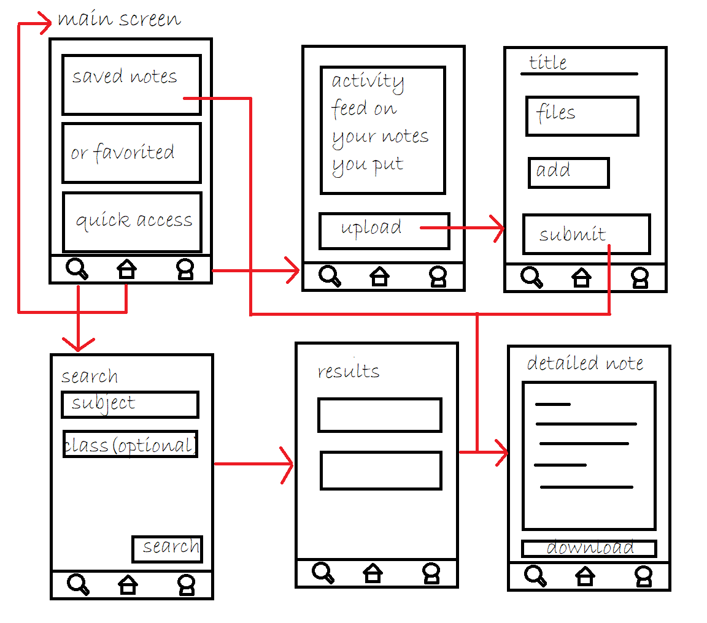
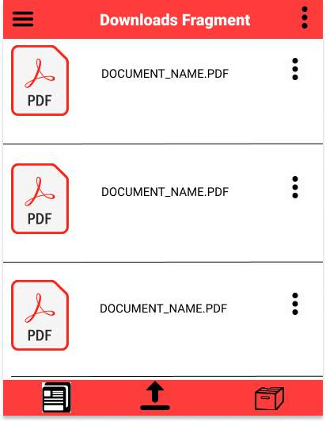
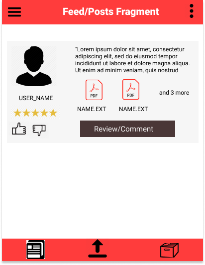
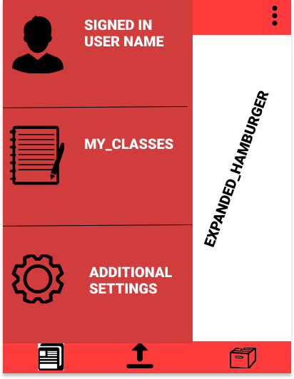
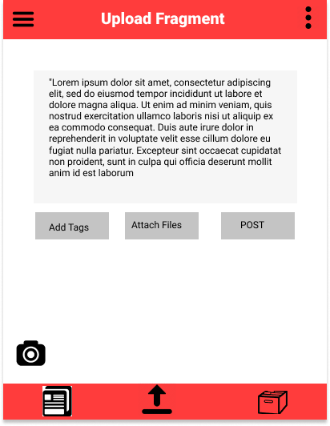

CodePath Group Project
======

# notes4notes

## Table of Contents
1. [Overview](#Overview)
1. [Product Spec](#Product-Spec)
1. [Wireframes](#Wireframes)
2. [Schema](#Schema)

## Overview
### Description
A way for Queens College students to exchange notes and resources easily and efficiently. 

### App Evaluation
- **Category:** Educational
- **Mobile:** Mobile allows the users to access the notes on the go and the camera can upload pictures directly.
- **Story:** Allows students to share notes during the semester and view from past students.
- **Market:** Students as well as possibly tutors or teaching assistants.
- **Habit:** Every time a student misses classes or prepares for a test in the semester, they would turn to the app and get notes.
- **Scope:** V1 would allow a person from Queens College to make an account and to upload their notes to the app and allows other Queens College students to view them. V2 allows user to rank the quality of the notes, to access highly rated apps, the user must upload notes.  

## Product Spec

### 1. User Stories (Required and Optional)

**Required Must-have Stories**

* Make an account. (Signup - Login)
* Upload notes     (.pdf, images).
* Parse Uploaded images into a .pdf. 
* Users should be able to Download notes as .pdf (Account Required). 
* The ability to rate uploads/posts. (Upload Rankings)
* The ability to view/select notes that you acquire or uploaded.
* Users can comment on notes

### Optional Nice-to-have Stories 
* Incorperate funtionality over multiple universities 
* Login using Google+ or Facebook. 
* Search (with or without filters. For example: The ability to sort by Subject, Professor etc.)
* The ability to suggest a correction to the uploader. 

### 2. Screen Archetypes
* Login/Sign-up Screen
   * Make an account. (Signup - Login)
* Main Activity
   *  The ability to view notes that you acquire or uploaded.
   *  Upload notes     (.pdf, images).
   *  Parse Uploaded images into a .pdf.
* Note Activity
   * Users should be able to Download notes as .pdf (Account Required). 
   * Users can comment on notes
   * The ability to rate uploads/posts. (Upload Rankings)

### 3. Navigation

**Tab Navigation** (Tab to Screen)

* Notes feed
* Upload notes
* User's profile page 

**Flow Navigation** (Screen to Screen)

* [Login]
   * [Signup]
* [Notes View]
   * Detailed View
   * Download
* [Upload]
   

## Wireframes

### Digital Wireframes & Mockups
## Version 1
 

 

## Version 2
 

 

## Schema 
[This section will be completed in Unit 9]

### Models

[User Model]
<table>
	<tr>
		<td>Property</td>
		<td>Data Type</td>
    <td>Description</td>
	</tr>
	<tr>
		<td>Username</td>
		<td>String</td>
    <td>User input alias</td>
	</tr>
  <tr>
		<td>Email</td>
		<td>String</td>
    <td>User input email</td>
	</tr>
  <tr>
		<td>Password</td>
		<td>String</td>
    <td>User input password</td>
	</tr>
  <tr>
		<td>CreatedAt</td>
		<td>date</td>
    <td>When the user was first created</td>
	</tr>
  <tr>
		<td>UserID</td>
		<td>String</td>
    <td>Unique identifier for database</td>
	</tr>
  <tr>
		<td>ProfilePicture</td>
		<td>image/file</td>
    <td>User chosen image</td>
	</tr>
  <tr>
		<td>SavedNotes</td>
		<td>String Array</td>
    <td>IDs of the user's favorited notes</td>
	</tr>
</table>

[Post Model]
<table>
	<tr>
		<td>Property</td>
		<td>Data Type</td>
    <td>Description</td>
	</tr>
  <tr>
		<td>PostID</td>
		<td>String</td>
    <td>The unique identifier for the database</td>
	</tr>
  <tr>
		<td>Title</td>
		<td>String</td>
    <td>User inputted title for the post</td>
	</tr>
  <tr>
		<td>Description</td>
		<td>String</td>
    <td>User input description of the notes</td>
	</tr>
  <tr>
		<td>Class</td>
		<td>String</td>
    <td>User input of what class the notes are for</td>
	</tr>
  <tr>
		<td>Files</td>
		<td>file</td>
    <td>User uploaded notes that will be displayed</td>
	</tr>
  <tr>
		<td>Rating</td>
		<td>Double</td>
    <td>The average of user input ratings on the note</td>
	</tr>
  <tr>
		<td>CommentID</td>
		<td>String</td>
    <td>Identifier to which comment thread is related to this post</td>
	</tr>
  <tr>
		<td>CreatedAt</td>
		<td>date</td>
    <td>The date this post was uploaded</td>
	</tr>
</table>
[Comment Model]
<table>
  <tr>
		<td>Property</td>
		<td>Data Type</td>
    <td>Description</td>
	</tr>
	<tr>
		<td>CommentID</td>
		<td>String</td>
    <td>Unique identifier for this comment post in the DB</td>
	</tr>
  <tr>
		<td>PostID</td>
		<td>String</td>
    <td>FK for which post this comment thread belongs to</td>
	</tr>
  <tr>
		<td>CommentContent</td>
		<td>String</td>
    <td>User input comment that will be displayed</td>
	</tr>
  <tr>
		<td>UserID</td>
		<td>String</td>
    <td>FK for which user posted this comment</td>
	</tr>
  <tr>
		<td>CreatedAt</td>
		<td>date</td>
    <td>Date that this post was created</td>
	</tr>
</table>

### Networking
List of network requests by screen
* Home Feed Screen
    * (Read/GET) Uploaded notes
* Create Post Screen
  * (Create/POST) Create a new post object
  * (Update/PUT) Update user’s collection
* Profile Screen
  * (Read/GET) Query logged in user object
* Login Screen
  * (Create/POST) A new user to the database
* Post Activity
  * (Read/GET) Query specific post object
  * (Update/PUT) User’s saved notes 
  * (Update/PUT) Comments
* Search Screen
  * (Read/GET) Query specific database for posts
* Post Activity
  * (Read/GET) Query specific post object

